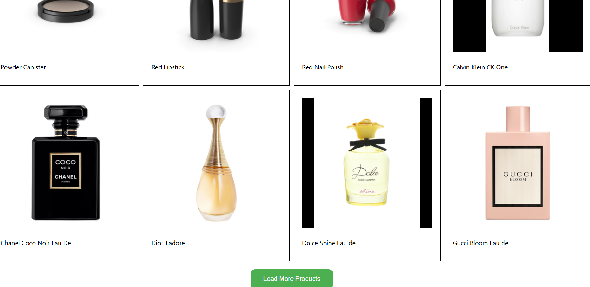

# Loading picture project

it shows how to fetch picture with limit of 20
and when we click the more button it adds
next 20 product pictures

in this project i use useState and UseEffect hooks

it has also make the button disable once it reaches
100 product image displayed

the container display as flex with the direction of column

and each product-container display as grid with grid-template-column 
four each has one fractional unit (repeat(4,1fr)) and with the
gap 10 px

and again each specific product display flex direction column

# final page looks like

# bisrat Nov 15, 2024